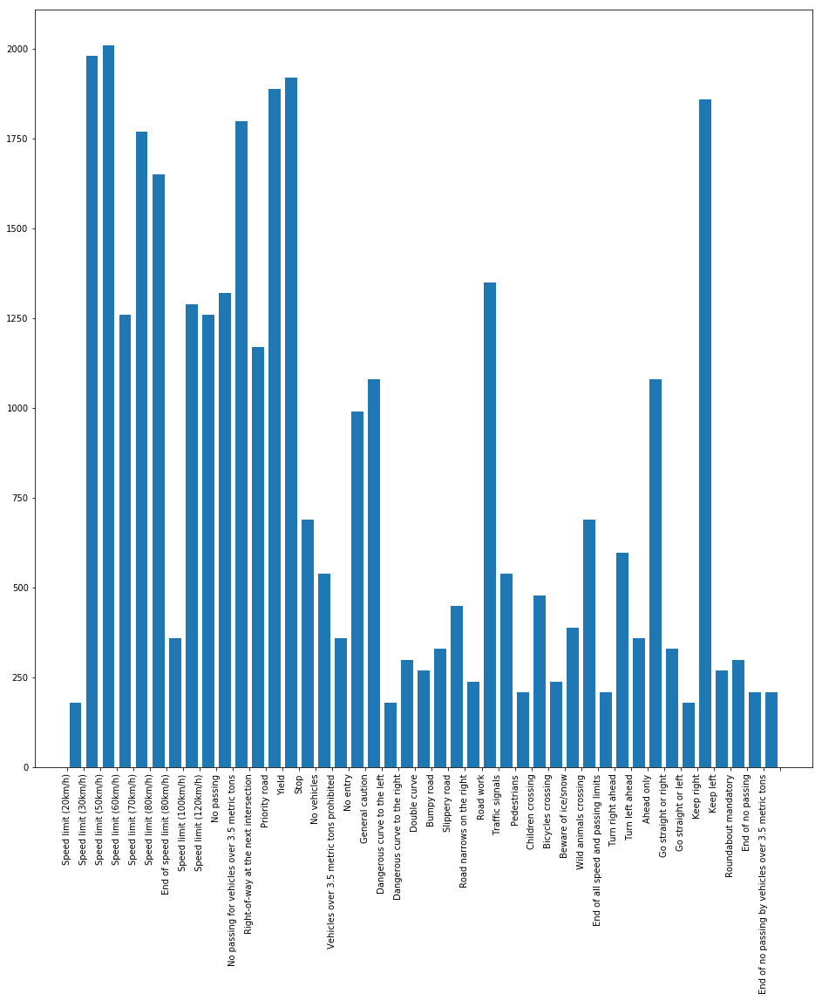
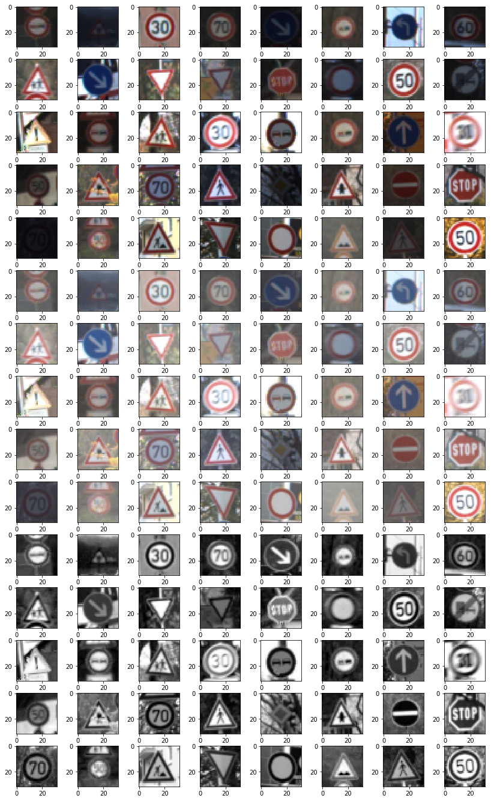
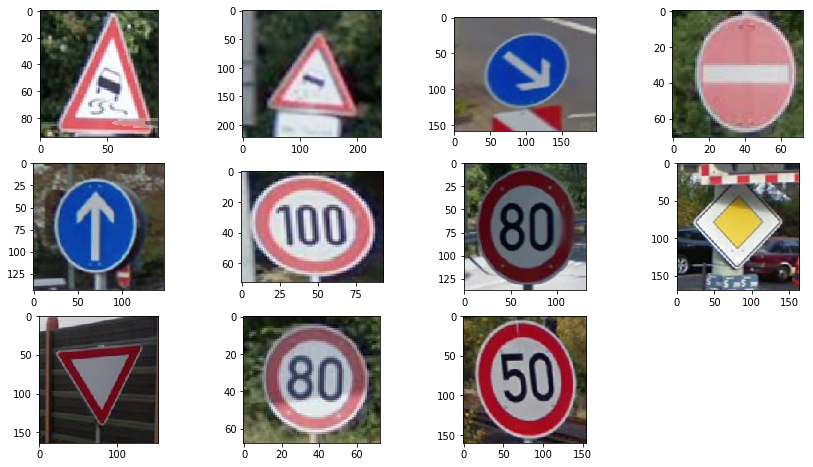

# **Traffic Sign Recognition** 

## Writeup

**Build a Traffic Sign Recognition Project**

The goals / steps of this project are the following:
* Load the data set (see below for links to the project data set)
* Explore, summarize and visualize the data set
* Design, train and test a model architecture
* Use the model to make predictions on new images
* Analyze the softmax probabilities of the new images
* Summarize the results with a written report


[//]: # (Image References)

[image1]: ./examples/visualization.jpg "Visualization"
[image2]: ./examples/grayscale.jpg "Grayscaling"
[image3]: ./examples/random_noise.jpg "Random Noise"
[image4]: ./examples/placeholder.png "Traffic Sign 1"
[image5]: ./examples/placeholder.png "Traffic Sign 2"
[image6]: ./examples/placeholder.png "Traffic Sign 3"
[image7]: ./examples/placeholder.png "Traffic Sign 4"
[image8]: ./examples/placeholder.png "Traffic Sign 5"

## Rubric Points
### Here I will consider the [rubric points](https://review.udacity.com/#!/rubrics/481/view) individually and describe how I addressed each point in my implementation.  

---
### Writeup / README

#### 1. Provide a Writeup / README that includes all the rubric points and how you addressed each one. You can submit your writeup as markdown or pdf. You can use this template as a guide for writing the report. The submission includes the project code.

You're reading it! and here is a link to my [project code](https://github.com/gonzaloruizdevilla/blob/master/Traffic_Sign_Classifier.ipynb)

### Data Set Summary & Exploration

#### 1. Provide a basic summary of the data set. In the code, the analysis should be done using python, numpy and/or pandas methods rather than hardcoding results manually.

I used pythons methods `len` and `set` to get this information:

* Number of training examples = 34799
* Number of testing examples = 12630
* Number of validation examples = 4410
* Image data shape = (32, 32, 3)
* Number of classes = 43

#### 2. Include an exploratory visualization of the dataset.

Here is an exploratory visualization of the data set. It is a bar chart showing how the train images are distributed between different categories:



### Design and Test a Model Architecture

#### 1. Describe how you preprocessed the image data. What techniques were chosen and why did you choose these techniques? Consider including images showing the output of each preprocessing technique. Pre-processing refers to techniques such as converting to grayscale, normalization, etc. (OPTIONAL: As described in the "Stand Out Suggestions" part of the rubric, if you generated additional data for training, describe why you decided to generate additional data, how you generated the data, and provide example images of the additional data. Then describe the characteristics of the augmented training set like number of images in the set, number of images for each class, etc.)

As a first step, I decided to play with gamma transformation using `cv2.LUT` method. For a gamma value of 2, many dark images became more identificable while bright images were not too much degrades.

I tried converting the images to gray scale and training with them.

In the following set of images, the first 20 are the originals, the second 20 gamma corrected and the last 20 in gray scale.



To introduce more variability on the images, I used ImageDataGenerator from Keras to augment the cases for the training. I configured zoom and rotation for data augmentation. I want to add a custom function to introduce a perspective distorsion to simulate signs being watched from differente angles.


#### 2. Describe what your final model architecture looks like including model type, layers, layer sizes, connectivity, etc.) Consider including a diagram and/or table describing the final model.

I tried with gray images, with an input of 32x32x1, but finally opted to conserve the three color channels.

My final model consisted of the following layers:

| Layer         		|     Description	        					| 
|:---------------------:|:---------------------------------------------:| 
| Input         		| 32x32x3 RGB image   							| 
| Convolution 3x3     	| 1x1 stride, same padding, outputs 28x28x6 	|
| RELU					|												|
| Dropout    			|												|
| Max pooling	      	| 2x2 stride,  outputs 10x10x16  				|
| Convolution 3x3     	| 1x1 stride, same padding, outputs 28x28x6 	|
| RELU					|												|
| Dropout    			|												|
| Max pooling	      	| 2x2 stride,  outputs 5x5x1  6  				|
| Flatten       		| 400       									|
| RELU					|												|
| Fully connected		| 120        									|
| RELU					|												|
| Fully connected		| 84        									|
| RELU					|												|
| Fully connected		| 43 (num classes)      							|
| Softmax				|         									|

I want to try ELU, LeakyReLU and GELU activations functions and see if there is any difference.

#### 3. Describe how you trained your model. The discussion can include the type of optimizer, the batch size, number of epochs and any hyperparameters such as learning rate.

To train the model, I used the following parameters:
* Learning rate: 0.001
* mu = 0
* sigma = 0.1
* epochs = 60
* batch size = 128
* keep probability = 0.5
* image data generator
  *  rotation range=10
  * zoom range=.2  

#### 4. Describe the approach taken for finding a solution and getting the validation set accuracy to be at least 0.93. Include in the discussion the results on the training, validation and test sets and where in the code these were calculated. Your approach may have been an iterative process, in which case, outline the steps you took to get to the final solution and why you chose those steps. Perhaps your solution involved an already well known implementation or architecture. In this case, discuss why you think the architecture is suitable for the current problem.

My final model results were:
* training set accuracy of 0.988
* validation set accuracy of 0.951
* test set accuracy of 0.951


I first started with the Lenet architecture which gave good results. I tried with gray images and gamma corrected images, with quite similar results, being the training with color images about 30% slower.

I tried to use a lower learning rate, but it only slowed the learning with no improvement in the results.

Later, I added dropout layers which improved the test accuracy a little. I am yet to try the training with batch normalization.

When I tried with images from the Internet (Google Street View) I found out that the sign images needed to be quite well cropped around the sign to increase efficency of the sign detection. If the sign occupied a small area in the image, the prediction failed a lot, and to improve the accuracy I used Keras ImageDataGenerator to add more examples with different sizes and rotations.

Given that 


If an iterative approach was chosen:
* What was the first architecture that was tried and why was it chosen?
* What were some problems with the initial architecture?
* How was the architecture adjusted and why was it adjusted? Typical adjustments could include choosing a different model architecture, adding or taking away layers (pooling, dropout, convolution, etc), using an activation function or changing the activation function. One common justification for adjusting an architecture would be due to overfitting or underfitting. A high accuracy on the training set but low accuracy on the validation set indicates over fitting; a low accuracy on both sets indicates under fitting.
* Which parameters were tuned? How were they adjusted and why?
* What are some of the important design choices and why were they chosen? For example, why might a convolution layer work well with this problem? How might a dropout layer help with creating a successful model?

If a well known architecture was chosen:
* What architecture was chosen?
* Why did you believe it would be relevant to the traffic sign application?
* How does the final model's accuracy on the training, validation and test set provide evidence that the model is working well?
 

### Test a Model on New Images

#### 1. Choose five German traffic signs found on the web and provide them in the report. For each image, discuss what quality or qualities might be difficult to classify.

Here are  German traffic signs that I found on the web (Google Street View):



This images have a different luminosity, perspective and sharpness and one has something blocking the top of the sign.


#### 2. Discuss the model's predictions on these new traffic signs and compare the results to predicting on the test set. At a minimum, discuss what the predictions were, the accuracy on these new predictions, and compare the accuracy to the accuracy on the test set (OPTIONAL: Discuss the results in more detail as described in the "Stand Out Suggestions" part of the rubric).

Here are the results of the prediction:

| Image			        |     Prediction	        					| 
|:---------------------:|:---------------------------------------------:| 
| Slippery Road     	| Slippery Road   								| 
| Slippery Road     	| Slippery Road  								|
| Keep right			| Keep right									|
| No entry	      		| No entry  					 				|
| Ahead only	    	| Ahead only  					 				|
| 100 km/h	      		| 100 km/h  					 				|
| 80 km/h	      		| 80 km/h  					 	    			|
| Priority Road	    	| Priority Road  			     	    		|
| Yield	    	        | Yield  			     	    	        	|
| 80 km/h	      		| 80 km/h  					 	    			|
| 50 km/h	      		| 50 km/h  					 	    			|


These are the images with their prediction.


The model was able to correctly guess 11 of the 11 traffic signs, which gives an accuracy of 100%. 

#### 3. Describe how certain the model is when predicting on each of the five new images by looking at the softmax probabilities for each prediction. Provide the top 5 softmax probabilities for each image along with the sign type of each probability. (OPTIONAL: as described in the "Stand Out Suggestions" part of the rubric, visualizations can also be provided such as bar charts)

The code for making predictions on my final model is:
```
with tf.Session() as sess:
    saver.restore(sess, tf.train.latest_checkpoint('.'))
    predictions = sess.run(tf.argmax(softmax,1), feed_dict={x: images_scaled, keep_prob: 1})
```

For the first image, the model is relatively sure that this is a stop sign (probability of 0.6), and the image does contain a stop sign. The top five soft max probabilities were

| Probability         	|     Prediction	        					| 
|:---------------------:|:---------------------------------------------:| 
| .99634945         	| 1_ahead_only.png   							| 
| .99999845     		| 2_priority_road.png 							|
| .94102347				| 3_no_entry.png								|
| .99905735	      		| 4_keep_right.png								|
| .8426207				| 5_speed_limit_80.png      					|
| .7283252              | 6_speed_limit_80.png                          |
| .337797641            | 7_speed_limit_100.png                         |
| .9850042              | 8_speed_limit50.png                           |
| .8457679              | 9_slippery_road.png                           |
| .47448257             | 10_slippery_road.png                          |
| 1.0                   | 11_yield.png                                  |


For each image, the top 3 largest probabilites where the next:

File: 1_ahead_only.png
* 1st  Ahead only 0.99634945
* 2nd  Go straight or right 0.0033083507
* 3rd  Turn left ahead 0.00026016386

File: 2_priority_road.png
* 1st  Priority road 0.99999845
* 2nd  No passing for vehicles over 3.5 metric tons 1.2385375e-06
* 3rd  No entry 1.8538498e-07

File: 3_no_entry.png
* 1st  No entry 0.94102347
* 2nd  Stop 0.058901753
* 3rd  Yield 1.7398934e-05

File: 4_keep_right.png
* 1st  Keep right 0.99905735
* 2nd  Go straight or right 0.00070822827
* 3rd  Turn left ahead 0.00021951033

File: 5_speed_limit_80.png
* 1st  Speed limit (80km/h) 0.8426207
* 2nd  Speed limit (60km/h) 0.10409802
* 3rd  Speed limit (50km/h) 0.04300775

File: 6_speed_limit_80.png
* 1st  Speed limit (80km/h) 0.7283252
* 2nd  Speed limit (60km/h) 0.11351273
* 3rd  Speed limit (50km/h) 0.08607156

File: 7_speed_limit_100.png
* 1st  Speed limit (100km/h) 0.33779764
* 2nd  Speed limit (80km/h) 0.17523673
* 3rd  Speed limit (30km/h) 0.16399518

File: 8_speed_limit50.png
* 1st  Speed limit (50km/h) 0.9850042
* 2nd  Speed limit (30km/h) 0.010324949
* 3rd  Speed limit (80km/h) 0.0039908634

File: 9_slippery_road.png
* 1st  Slippery road 0.8457679
* 2nd  Dangerous curve to the left 0.08005107
* 3rd  Wild animals crossing 0.04296077

File 10_slippery_road.png
* 1st  Slippery road 0.47448257
* 2nd  Dangerous curve to the left 0.25787917
* 3rd  Wild animals crossing 0.16625506

File: 11_yield.png
* 1st  Yield 1.0
* 2nd  No vehicles 3.6443094e-08
* 3rd  Speed limit (60km/h) 9.1558566e-11

### (Optional) Visualizing the Neural Network (See Step 4 of the Ipython notebook for more details)
#### 1. Discuss the visual output of your trained network's feature maps. What characteristics did the neural network use to make classifications?


